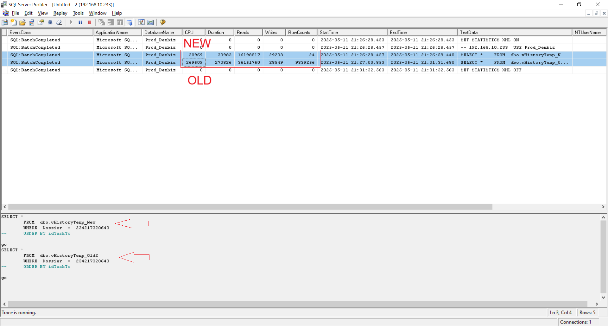
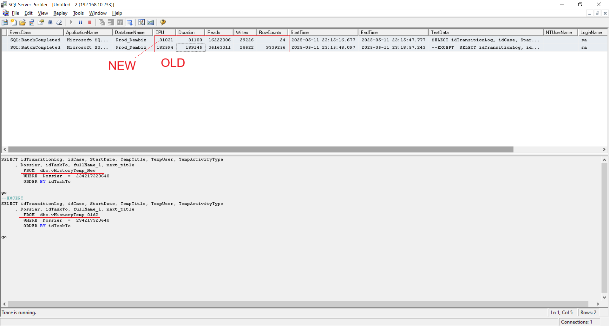
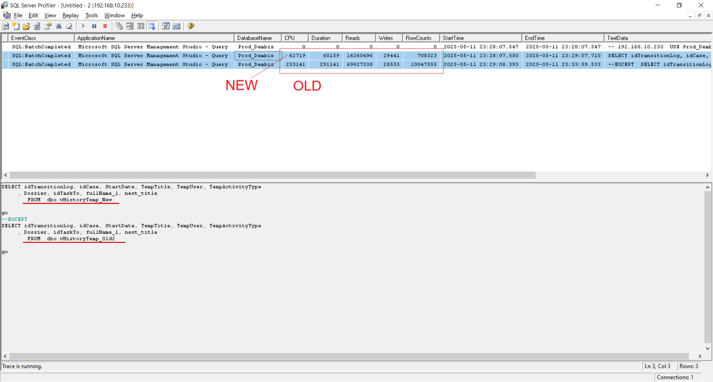

# Optimizing View dbo.vHistoryTemp

## 1) Context
- SQL Server Version/Edition: SQL Server 2019 Enterprise
- Workload Type: OLTP / Reporting
- Object: View `dbo.vHistoryTemp`
- Approx. Data Size: Very large (tens of millions of rows)
- Usage: Frequently accessed, critical for business reporting

---

## 2) Problem
The view was very large and complex, heavily used in the system.  
It included:
- Multiple subqueries
- Several User Defined Functions (UDFs)
- Many unused columns

One **critical subquery** returned a very large number of rows and controlled the entire final output of the view.  
This subquery was the major bottleneck:  
- It was always slow
- It returned too many rows
- All view execution times depended on it

Baseline execution metrics for the original view:
- Duration: **382,786 ms**
- CPU: **326,704 ms**
- Logical Reads: **85,883,989**

---

## 3) Investigation
- Initial optimization steps: rewriting the query, removing unnecessary columns, and reducing/eliminating UDF calls.  
- However, the critical subquery still caused severe performance issues.  
- Analysis of usage patterns showed the view was **always executed with a specific filter condition**, but that filter was applied at the **end** of the view, after all rows had already been processed.  

This meant the filter did not help reduce rows early in the pipeline, leaving the expensive subquery unaffected.

---

## 4) Change Applied
Two separate optimization phases were performed:

### Phase 1 – Query Rewriting (No Application Change Required)
- Actions:
  - Rewrote parts of the view.
  - Removed unnecessary columns from subqueries.
  - Eliminated or reduced calls to User Defined Functions (UDFs).
- Benefits:
  - Significant improvement without requiring any changes to the application code.
  - Safer to deploy because the interface between application and database remained the same.
- Drawbacks:
  - The critical subquery still returned too many rows.
  - While performance improved greatly, it was not fully optimized.

### Phase 2 – Injecting Filter via `SESSION_CONTEXT` (Requires Application Change)
- Actions:
  - Observed that the view was always executed with a specific filter condition.
  - Moved this condition into the critical subquery.
  - To achieve this, used **`SESSION_CONTEXT`**:
    - Before executing the query, the application sets the filter value into `SESSION_CONTEXT`.
    - The view reads this value and applies the filter early inside the subquery.
- Benefits:
  - Dramatic performance gain, with execution time reduced to a fraction of a second.
  - The subquery processes only relevant rows from the start.
- Drawbacks:
  - Requires changes in the application code (to set the session value before execution).
  - Adds dependency on session state management.

---

## 5) Results

### Performance Comparison
| Metric                  | Original View | First Optimization | Final Optimization | Improvement First Optimization | Improvement Final Optimization |
|-------------------------|--------------:|-------------------:|-------------------:|-------------------------------:|-------------------------------:|
| Duration (ms)           | 382,786       | 29,332             | 228                | **92.3% ↓**                    | **99.94% ↓**                   |
| CPU (ms)                | 326,704       | 29,265             | 118                | **91.0% ↓**                    | **99.96% ↓**                   |
| Logical Reads           | 85,883,989    | 16,213,155         | 15,693             | **81.1% ↓**                    | **99.98% ↓**                   |

---

## 6) Scripts Used
- Original script cannot be shared due to confidentiality.  
- Optimized structure (simplified example):

```sql
-- Application layer
EXEC sys.sp_set_session_context @key = N'HistoryFilter', @value = @FilterValue;

-- Inside dbo.vHistoryTemp (simplified)
SELECT ...
FROM (
    SELECT ...
    FROM SomeBigTable t
    WHERE t.FilterColumn = CAST(SESSION_CONTEXT(N'HistoryFilter') AS INT)
) q
...
```

---

## 7) Visual Evidence (Phase 1 & Phase 2)

### 7.1 Phase 1 – Query Rewriting (No App Change)
**Before vs After (Phase 1)**

| Original View (Before) & Phase 1 (After) |
|:----------------------------------------:|
|  |
|  |
|  |

---

### 7.2 Phase 2 – Injecting Filter via `SESSION_CONTEXT` (Requires App Change)
**Original vs Phase 1 vs Phase 2**

| Original View (Before) & Phase 1 & Phase 2 |
|:-----------------------------------:|
|  |

---

### 7.3 Compare results
**Original vs Phase 1 vs Phase 2**

| Original View (Before) & Phase 1 & Phase 2 |
|:----------------------------------:|
|  |
|  |

