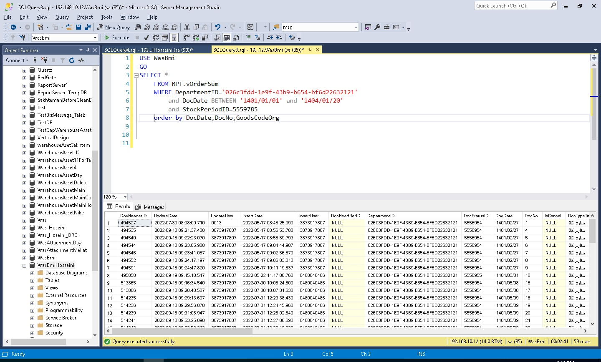
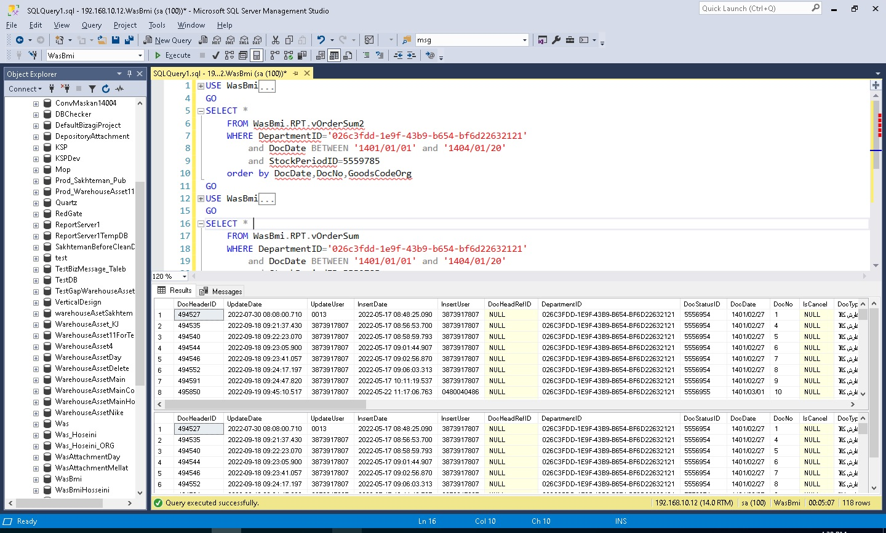

# Optimizing Reporting View RPT.vOrderSum for Performance

## 1) Context
- SQL Server Version/Edition: SQL Server 2019 Enterprise
- Workload Type: OLTP
- Objects:  Table / Query / View / UDF
- Approx. Data Size: 1 GB

---

## 2) Problem
- Symptom: long duration, excessive logical reads
- Baseline snapshot
  - Duration: 299405ms
  - CPU: 197376ms
  - Logical Reads: 2142556

- Example (Before Plan):

---

## 3) Investigation
This view was very large and heavy, so I started analyzing the query structure.
After my review, I found that part of the query used a subquery which returned around 1,000,000 rows, and for some columns of these rows it was calling UDFs (User Defined Functions).
I began to optimize and rewrite the query structure by removing all extra columns that were not needed in the final output, and I also removed or reduced the usage of UDFs as much as possible.

---

## 4) Performance Comparison
| Metric        | Before       | After   | Improvement |
|---------------|-------------:|--------:|------------:|
| Duration      | 299,405 ms   | 6,192 ms | 97.9% ↓ |
| CPU           | 197,376 ms   | 2,969 ms | 98.5% ↓ |
| Logical Reads | 2,142,556    | 12,306   | 99.4% ↓ |

---

## 5) Change Applied
- Query rewriting
- Removing unused columns
- Eliminating or reducing the frequency of UDF usage

---

## 6) Results
- Duration: 6192ms
- CPU: 2969ms
- Logical Reads: 12306

---

## 7) Scripts Used
Since the script belongs to the employer, I am not able to share the original query.

---

## 8) Risks & Rollback
- Risks: For each subquery or UDF review, the output before and after optimization had to remain exactly the same.
It was also important to make sure that the results did not change in any other scenarios.

---

## 9) Combined Results
This screenshot shows both **before** and **after** execution times in a single view.
### Combined Results 1

### Combined Results 2

