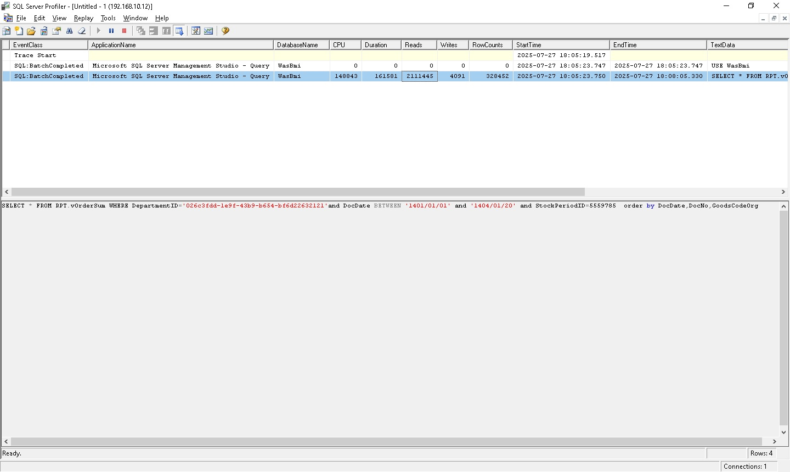

# SQL Server Performance Tuning — Case Studies & Scripts

This repository documents **real-world SQL Server performance tuning** work.  
Each folder is a **case study** with:
- A short write-up (problem → analysis → fix → result)
- **Before/After** screenshots (plans/metrics)
- Repro and scripts used

> ⚠️ Run on **non-production** first. Review and adapt scripts to your environment.

---

## 📂 Case Studies Overview

Here are some highlights from performance tuning cases:

### Case 01 – Optimizing Reporting View RPT.vOrderSum
| Before | After |
|:------:|:-----:|
|  |  |

👉 [Read full case study](./2025-07-16/README.md)

