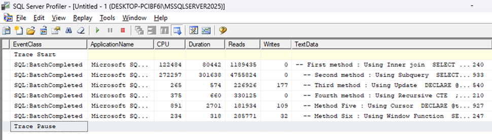
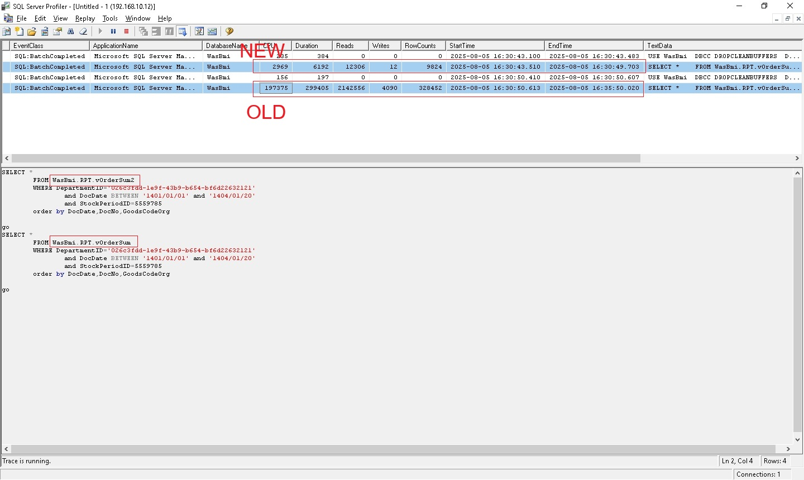

# SQL Server Performance Tuning — Case Studies & Scripts

This repository documents **real-world SQL Server performance tuning** work.  
Each folder is a **case study** with:
- A short write-up (problem → analysis → fix → result)
- **Before/After** screenshots (plans/metrics)
- Repro and scripts used

> ⚠️ Run on **non-production** first. Review and adapt scripts to your environment.

---

## 📂 Case Studies Overview

Here are some highlights from performance tuning cases:

### Case 01 – Optimizing Heavy Queries (Running Total)

This case study explores different methods of calculating **Running Totals** in SQL Server and compares their performance.  
Six approaches were tested, from basic `JOIN` and `Subquery` methods to more advanced techniques like `Window Functions`.

| Execution Plans |
|:------:|
|  |

👉 [View scripts](./Case-Studies/2025-09-10_Running-Total/scripts/Scripts_SQL-Server.sql)
👉 [Read full case study](./Case-Studies/2025-09-10_Running-Total/readme.md)  

---

### Case 02 – Optimizing Reporting View RPT.vOrderSum
| Before / After |
|:------:|
|  |

👉 [Read full case study](./Case-Studies/2025-07-16/readme.md)

---

## 📂 Archive
You can browse all case studies in the repository:  
👉 [Full Case Study Archive](./SQL-Server-Performance-Tuning/Case-Studies)
